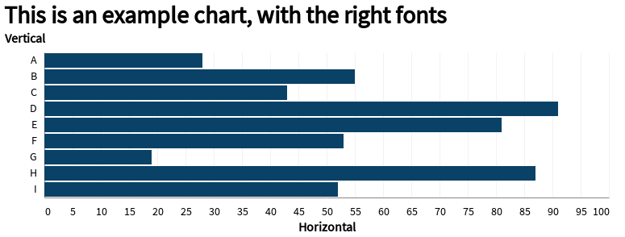

# Template mySociety Jupyter notebook

Template with submodule for helper functions, and dockerfile to set chrome up correctly for charts. 

This is useful for when the readme should include some analysis of files elsewhere in the repo and you don't want to copy and paste. 

`readme.ipynb` can be set up as a notebook, which then renders itself to `readme.md`. 

Example of this approach: https://github.com/mysociety/composite_uk_imd


## How to use

Should just work in VSCode, be careful if you start storing config in `devcontainer.json` as currently not excluded from git.

pandas and altair are automatically loaded as `pd` and `alt`. The mysociety theme is already initalised. 

Examples below show basic usage.

By default `render_to_markdown` will not print the input box (so code can be hidden). Add `include_input=True` as below to include it.

The chrome reference can be removed from the dockerfile if not doing any chart rendering. Currently the blank requirements.txt is not referenced in the dockerfile to avoid a layer, you'll need to add that if adding more requirements to the notebook.

The Dockerfile is set up to work with being viewed on binder.

# Example code

Start the notebook by pulling in the general set of helpers. Start the codeblock with `#HIDE` to exclude it from being displayed in render (example at top of `readme.ipynb`).


```python
from notebook_helper import *
notebook_setup()
```

## Example table

This shows a table being rendered as markdown


```python
source = pd.DataFrame({
    'Vertical': ['A', 'B', 'C', 'D', 'E', 'F', 'G', 'H', 'I'],
    'Horizontal': [28, 55, 43, 91, 81, 53, 19, 87, 52]
})

source["double_h"] = source["Horizontal"] * 2

source
```


| Vertical | Horizontal | double_h |
| :--- | :--- | :--- |
| A | 28 | 56 |
| B | 55 | 110 |
| C | 43 | 86 |
| D | 91 | 182 |
| E | 81 | 162 |
| F | 53 | 106 |
| G | 19 | 38 |
| H | 87 | 174 |
| I | 52 | 104 |


# Example chart


```python
chart = (Chart(source)
         .mark_bar()
         .encode(y='Vertical', x='Horizontal')
         .properties(title="This is an example chart, with the right fonts")
         .display_options(logo=True, caption="Data source goes here"))

chart.display()

```


    

    

